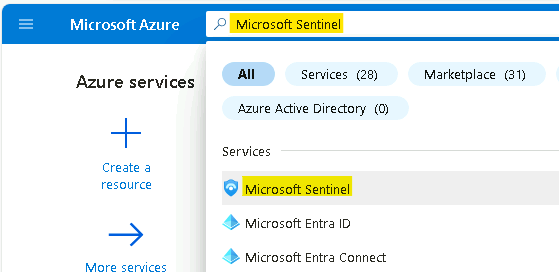
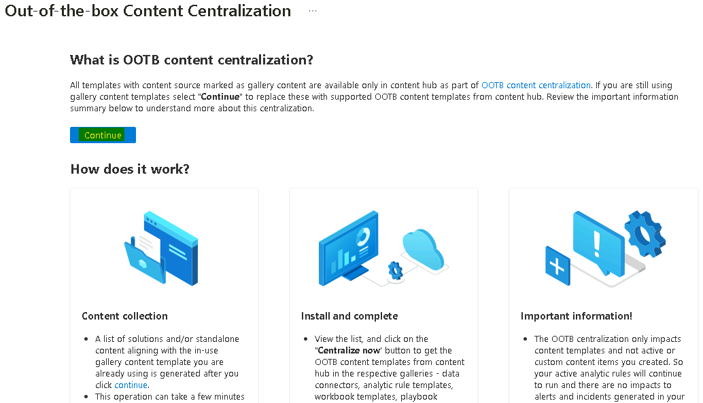
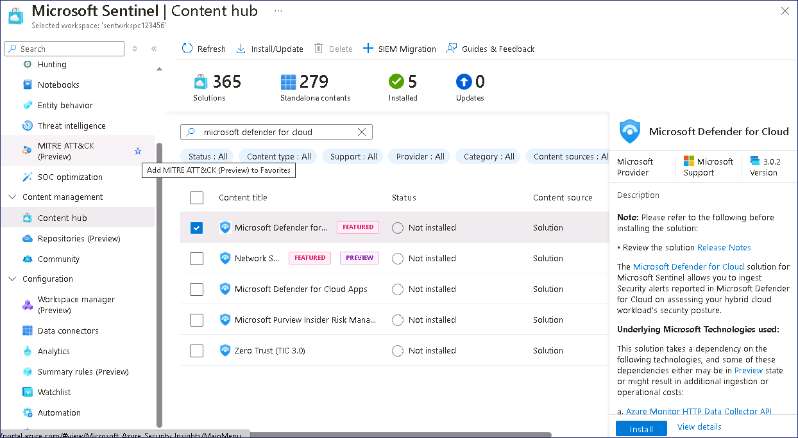
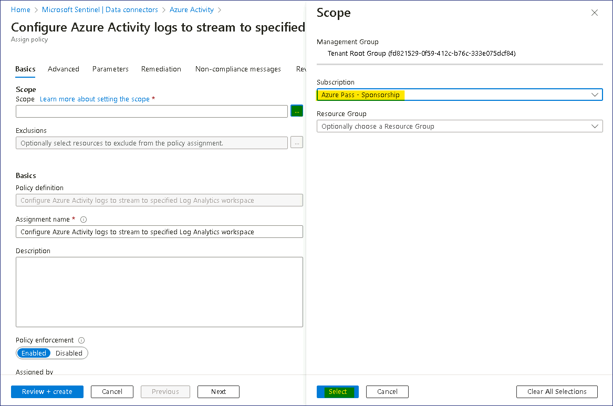
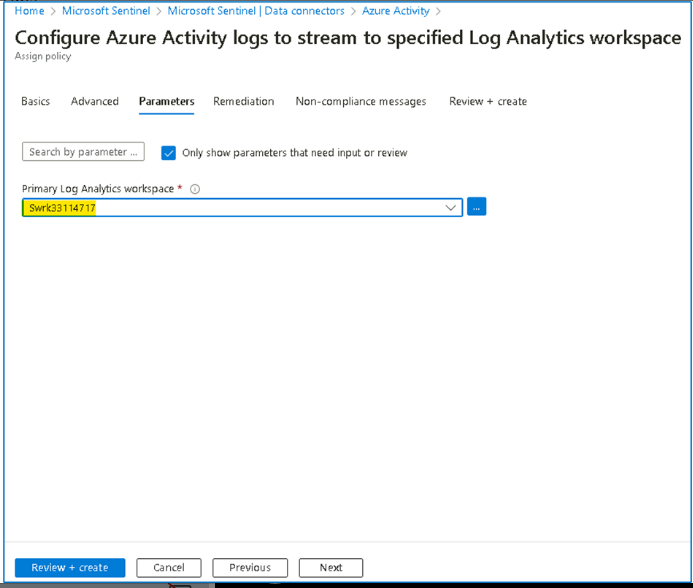
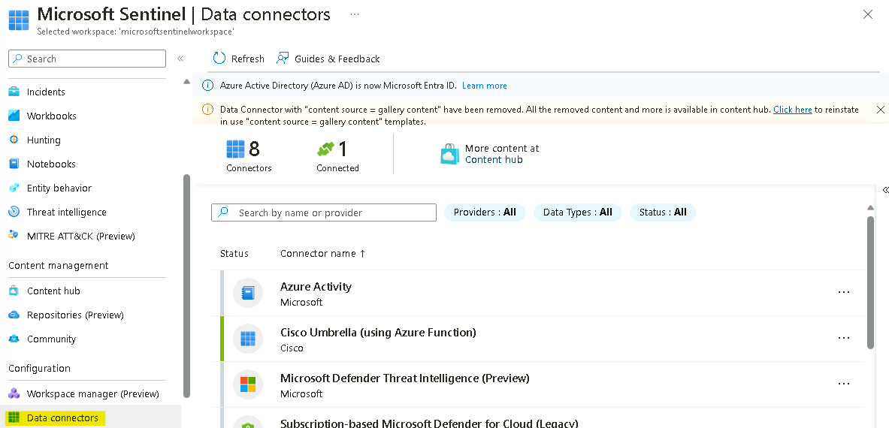

# Lab 2 - Enable Data Connectors in Microsoft Sentinel

## Objectives

In this Lab you will learn how to enable Data Connectors in Microsoft
Sentinel to bring alerts and/or telemetry from different sources.

**Prerequisites**

This lab assumes that you have completed **Lab 1**, as you will need an
Microsoft Sentinel workspace provisioned.

<font color=green>

> **Some of the data connectors that will be used in this lab, require some specific permissions on the workspace or your azure subscription. If you don't have the appropriate permissions, you can still continue doing the rest of the labs.**

</font>


## Exercise 1 - Enabling Data Connectors in Microsoft Sentinel

## Task 1: Enable and Install the Data connectors.

This exercise shows you how to enable Data connectors.

1.  On the Azure Portal
    ```https://portal.azure.com``` and search
    for ```Microsoft Sentinel``` and click on **Microsoft Sentinel**.

     

5.  Select **SentWrkspcXXXXXX**.

    <kbd></kbd>  

6.  Now select **Data Connectors** under **Configuration** section.

    <kbd></kbd>   
 

7.  You should get the message **Data Connector with "content source =
    gallery content" have been removed.** In that message select the
    **Click here** link

      <kbd></kbd>      

8.  On the **Out-of-the-box Content Centralization** page click on
    **Continue**

      <kbd></kbd>      

9.  Click on the **Complete centralization** button

      <kbd></kbd> 

10. You should receive the notification as shown in below image

      <kbd></kbd>   

      <font color=darkgreen>
      
      > **Note** - Sometime it may not install any connector, which is also fine to proceed ahead with the Labs.

      </font>


11. From the top click on the link for **Microsoft Sentinel** or
    navigate back to the Sentinel page.

      <kbd></kbd>
    
13. Click on the **Refresh** button and you should be able to see the few connectors
    Data connectors showing.

      <kbd></kbd> 
 

      <font color=darkgreen>
      
      > **Note** - Sometime it may not install any connector, which is also fine to proceed ahead with the Labs.

      </font>

14. Click on **Content hub** under **Content management**

    <kbd></kbd>
 

15. On the Content hub page search for ```Azure Activity``` and then
    select **Azure Activity** content and click on **Install** button

      <kbd></kbd> 
 

16. On the Content hub page search for ```Microsoft defender for cloud```
    and then select **Microsoft Defender for Cloud** content and click
    on **Install** button

      <kbd></kbd> 

17. On the Content hub page search for ```Threat Intelligence```
    and then select **Microsoft Defender Threat Intelligence (preview)** content and click
    on **Install** button

      <kbd></kbd> 


## Task 2 - Enabling Azure Activity data connector

This exercise shows you how to enable Data connectors.

1.  On the **Azure
    Portal** ```http://portal.azure.com```
    search for ```Microsoft Sentinel``` and click on **Microsoft
    Sentinel**.

    <kbd></kbd>

2.  Select **SwrkXXXXXXX**.

    <kbd></kbd>

3. Now select **Data Connectors** under **Configuration** section.

    <kbd></kbd>

3.  You should be able to see the **Data connectors** already available
    based on the selection made during the deployment.


    <kbd></kbd>

4.  On the data connectors screen, select the **Azure
    Activity** connector and click on **Open connector page**.

    <kbd></kbd>

5.  On the **Azure Activity connector** page, go to option number **2.
    Connect your subscriptions through diagnostic settings new
    pipeline**. This method leverages Azure Policy and it brings many
    improvements compared to the old method (more details about these
    improvements can be found here). Click on the **Launch Azure Policy
    Assignment** wizard, this will redirect you to the policy creation
    page.

    <kbd></kbd>

6.  On the **Scope** selection select **Azure Pass - Sponsorship** . do not select any Click **Select**.


    <kbd></kbd>

7.  Go to the **Parameters** tab. On the **Primary Log Analytics
    workspace** select the **SwrkXXXXXXX**.

    <kbd></kbd>

8.  Under **Remediation** tab, select the check box besides **Create a
    remediation task** and then click on **Review + create** button

    <kbd></kbd>

9.  On the **Review + create** tab, click on the **Create** button.

    <kbd></kbd>

11. In the **Notification** pane you will be able to see the '**Role
    Assignments creation succeeded**', '**Remediation task creation
    succeeded**' and '**Creating policy assignment succeeded**'
    notifications.

    <kbd></kbd>

12. On the **Azure Activity connector** page you will be able to see the
    connection status.

    > **Note**: It is normal if you don't immediately see the connector
    showing as connected and in green, it takes **around 30 minutes** for the
    process to complete. Also, each subscription has a maximum of 5
    destinations for its activity logs. If this limit is already reached,
    the policy created as part of this exercise won't be able to add an
    additional destination to your Microsoft Sentinel workspace.

    <kbd></kbd>

13. Continue to the next task then you can check back after 30 minutes.

14. Close the **Azure Activity** connector blade to go back to
    the **Data Connectors** page.

### Task 3 - Enabling Microsoft Defender for Cloud data connectors

This task shows you how to enable the Microsoft Defender for Cloud data
connectors. This connector allows you to stream your security alerts from
Microsoft Defender for Cloud into Microsoft Sentinel, so you can view
Defender data in workbooks, query it to produce alerts, and investigate
and respond to incidents.

1.  While still on the **Microsoft Sentinel** page click on **Data
    Connectors** under **Configuration** section.

      <kbd></kbd>    

2.  In the **Data connectors** screen, type ```tenant``` in the search
    bar, select the **Tenant-based Microsoft Defender for Cloud**
    **(Preview)</kbd>** connector and click on **Open connector page**.

      <kbd></kbd> 


      <kbd></kbd>

      > **Note** - If you receive the error **Data Connector Not Found**, then navigate to **Content Hub** and then Reinstall the **Microsoft Defender for Cloud Connector** again, close the browser and relaunch it. Navigate to the Azure Portal `https://portal.azure.com`


      <kbd></kbd>

3.  On the **Tenant-based Microsoft Defender for Cloud** **(Preview)</kbd>**
    connector page, under **Configuration** section click on the
    **Connect** button.

      <kbd></kbd>

4.  You should receive the notification as **Connected successfully.**

      <kbd></kbd>


5.  Wait for 1-2 minutes and then refresh the page, the Status of the
    connector should also be updated to **Connected.**

      <kbd></kbd> 


6.  Back on the **Data connectors** screen, type ```subscription``` in the
    search bar, select the **Subscription-based Microsoft Defender for
    Cloud** **(legacy)</kbd>** connector and click on **Open connector page**.

      <kbd></kbd>  

7.  On the **Subscription-based Microsoft Defender for Cloud**
    **(legacy)</kbd>** connector page, under **Configuration** section, select
    the **Azure Pass – Sponsorship** subscription and then click on the
    **Connect** button.

      <kbd></kbd>    

8.  You should receive the notification as **Connected successfully**.

      <kbd></kbd>  


9.  The Status of the connector should also be updated to **Connected.**

      <kbd></kbd>  


### Task 4 - Enabling Microsoft Defender Threat Intelligence connector

The **Microsoft Defender Threat Intelligence** (MDTI)</kbd> connector to your
Sentinel workspace, which ingests Microsoft Threat Intelligence
indicators automatically into the ThreatIntelligenceIndicator table.
MDTI provides a set of indicators and access to
the ```https://ti.defender.microsoft.com``` portal at no additional cost, with
the premium features of the MDTI portal and API requiring licensing.

The *Threat Intelligence* content solution includes the data connectors
for all supported forms of Threat Intelligence.

> **NOTE:** Sentinel also supports importing Threat Intelligence indicators via the TAXII protocol using the **Threat Intelligence -    TAXII** data connector, so if you have your own preferred TI source, you can add that to your workspace instead.

1.  On the **Azure
    Portal** ```http://portal.azure.com```
    search for ```Microsoft Sentinel``` and click on **Microsoft
    Sentinel**.

    <kbd></kbd>

2.  Select **SwrkXXXXXXX**.

    <kbd></kbd>

3.  From the left menu choose the ***Microsoft Defender Threat
    Intelligence (preview)</kbd>*** connector and click **Open Connector
    Page** at the bottom right.

    <kbd></kbd>

4.  On the Connector page, from the **Import indicators** list, leave
    the default "**All available**" selected, and click **Connect**.

    <kbd></kbd>

    <kbd></kbd>

5.  The Status of the Connector should be updated to **Connected.**

    <kbd></kbd>

6.  Threat Intelligence indicators will start being ingested into
    the **ThreatIntelligenceIndicator** table.

    <font color=green>

    > **Note** - We should have successfully installed all the below 4 Data connectors.
 
    * **Azure Activity**
    * **Tenant-based Microsoft Defender for Cloud (Preview)**
    * **Subscription-based Microsoft Defender for Cloud (Legacy)**
    * **Microsoft Defender Threat Intelligence (preview)**

    </font>
